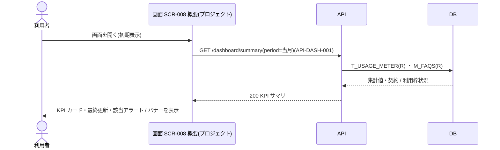
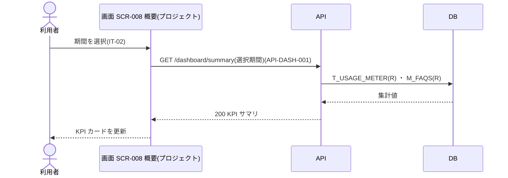

<!-- portal-top -->
[設計ポータル](../README.md) ／ [ユースケース](index.md) ／ **UC-SCR-008: 概要(プロジェクト) ユースケース**
<!-- /portal-top -->

# UC-SCR-008: 概要(プロジェクト) ユースケース

> **このページは、画面 SCR-008(概要(プロジェクト))の画面イベント EV-01〜EV-08 に対応する 8 つのユースケースを「1 イベント = 1 ユースケース」で定義します。**

*版数 v1.0 ・ 更新 2026-06-21 ・ ユースケース 8 ・ ステータス ドラフト*

## 0. イベント↔ユースケース対応表

画面 [SCR-008](../02_basic-design/SCR-008.md#SCR-008) の §6 画面イベント一覧(EV-01〜EV-08)を、ユースケース ID へ 1:1 で対応づけます。種別は、サーバ API・DB へアクセスする「API/DB 連携」と、画面内のみで完結する「クライアント内処理のみ」に区別します。

| イベント ID | イベント名 | ユースケース ID | 種別 |
|----|----|----|----|
| `EV-01` | 初期表示 | [UC-SCR-008-EV01](#UC-SCR-008-EV01) | API/DB 連携 |
| `EV-02` | 期間を選択 | [UC-SCR-008-EV02](#UC-SCR-008-EV02) | API/DB 連携 |
| `EV-03` | 質問数カードを押下 | [UC-SCR-008-EV03](#UC-SCR-008-EV03) | クライアント内処理のみ |
| `EV-04` | 未解決数カードを押下 | [UC-SCR-008-EV04](#UC-SCR-008-EV04) | クライアント内処理のみ |
| `EV-05` | 公開 FAQ 件数カードを押下 | [UC-SCR-008-EV05](#UC-SCR-008-EV05) | クライアント内処理のみ |
| `EV-06` | 「支払方法を更新」を押下(オーナー) | [UC-SCR-008-EV06](#UC-SCR-008-EV06) | クライアント内処理のみ |
| `EV-07` | 「支払い方法を登録」を押下(オーナー) | [UC-SCR-008-EV07](#UC-SCR-008-EV07) | クライアント内処理のみ |
| `EV-08` | 「利用量と上限へ」を押下 | [UC-SCR-008-EV08](#UC-SCR-008-EV08) | クライアント内処理のみ |

## 1. ユースケース定義

### UC-SCR-008-EV01 初期表示

> 概要画面を開いたとき、当月の KPI 集計(質問数・未解決数・公開 FAQ 件数)を取得して KPI カードへ表示し、契約状態・利用枠の状況に応じてアラート・バナーを表示します。

| 項目 | 内容 |
|----|----|
| 利用者 | オーナー / 当該プロジェクトのメンバー |
| 事前条件 | ログイン済みで、当該プロジェクトへの割当がある |
| トリガー | 画面 SCR-008 を開く(初期表示) |
| 事後条件 | KPI カード(IT-05〜IT-07)に集計値を表示し、最終更新タイムスタンプ(IT-03)を表示する。契約停止・利用枠超過・質問数上限到達の各条件でアラート(IT-04)・バナー(IT-08 / IT-09)を表示する |
| 関連 | [SCR-008](../02_basic-design/SCR-008.md#SCR-008) ・ [API-DASH-001](../02_basic-design/API-dashboard.md#API-DASH-001) ・ [FR-077](../01_requirements/FR10.md#FR-077) |

基本フロー

1. 利用者が概要画面を開く。
2. 画面はデフォルト期間(当月)と当該プロジェクトを条件にダッシュボードサマリ API を呼び出す。
3. API は認証・認可を検証し、質問数・未解決数・公開 FAQ 件数の集計を取得して返す。
4. 画面は KPI カード(IT-05〜IT-07)へ集計値を表示し、最終更新タイムスタンプ(IT-03)を表示する。集計が 5 分以上前なら「集計遅延」を黄表記する。
5. 契約状態が停止中の場合、画面はサスペンション中アラート(IT-04)を表示する。
6. 無料利用枠を超過している場合は超過バナー(IT-08)、質問数が月次上限到達の場合は上限到達バナー(IT-09)を表示する。

異常系フロー

- 認可エラー(403): 当該プロジェクトへの割当がない場合、権限不足を表示する。
- 取得失敗: 各カードをエラー状態で表示し、クリック不可とする。

### UC-SCR-008-EV02 期間を選択

> 期間を選択すると、その期間で KPI 集計を再取得し、KPI カードを更新します。

| 項目 | 内容 |
|----|----|
| 利用者 | オーナー / 当該プロジェクトのメンバー |
| 事前条件 | 概要画面を表示している |
| トリガー | 期間選択(IT-02)で期間を選択する(当月 / 前月 / 任意期間) |
| 事後条件 | 選択期間の集計値で KPI カードを更新する |
| 関連 | [SCR-008](../02_basic-design/SCR-008.md#SCR-008) ・ [API-DASH-001](../02_basic-design/API-dashboard.md#API-DASH-001) |

基本フロー

1. 利用者が期間選択(IT-02)で当月 / 前月 / 任意期間を選択する。
2. 画面は選択期間と当該プロジェクトを条件にダッシュボードサマリ API を再取得する。
3. API は選択期間の集計値を取得して返す。
4. 画面は KPI カード(IT-05〜IT-07)を更新する。

異常系フロー

- 取得失敗: 各カードをエラー状態で表示し、クリック不可とする。

### UC-SCR-008-EV03 質問数カードを押下

> 質問数カードを押下し、要対応の質問一覧へ遷移します(クライアント内処理のみ)。

| 項目 | 内容 |
|----|----|
| 利用者 | オーナー / 当該プロジェクトのメンバー |
| 事前条件 | 概要画面を表示し、質問数カードがクリック可能(集計成功・1 件以上)である |
| トリガー | 質問数カード(IT-05)を押下する |
| 事後条件 | 要対応の質問一覧(SCR-005)へ遷移する(絞り込みなし) |
| 関連 | [SCR-008](../02_basic-design/SCR-008.md#SCR-008) ・ [SCR-005](../02_basic-design/SCR-005.md#SCR-005) |

基本フロー

1. 利用者が質問数カード(IT-05)を押下する。
2. 画面は要対応の質問一覧(SCR-005)へ遷移する(絞り込みなし)。

異常系フロー

- 0 件・集計中・取得失敗時はカードが非活性のため、本イベントは発生しない。

クライアント内処理のみ(画面遷移)のため、シーケンス図は省略します。

### UC-SCR-008-EV04 未解決数カードを押下

> 未解決数カードを押下し、未解決(対応中)で絞り込んだ要対応の質問一覧へ遷移します(クライアント内処理のみ)。

| 項目 | 内容 |
|----|----|
| 利用者 | オーナー / 当該プロジェクトのメンバー |
| 事前条件 | 概要画面を表示し、未解決数カードがクリック可能(集計成功・1 件以上)である |
| トリガー | 未解決数カード(IT-06)を押下する |
| 事後条件 | 要対応の質問一覧(SCR-005)へ `status=open` で絞り込んで遷移する |
| 関連 | [SCR-008](../02_basic-design/SCR-008.md#SCR-008) ・ [SCR-005](../02_basic-design/SCR-005.md#SCR-005) |

基本フロー

1. 利用者が未解決数カード(IT-06)を押下する。
2. 画面は要対応の質問一覧(SCR-005)へ `status=open` の絞り込み条件を引き継いで遷移する。

異常系フロー

- 0 件・集計中・取得失敗時はカードが非活性のため、本イベントは発生しない。

クライアント内処理のみ(画面遷移)のため、シーケンス図は省略します。

### UC-SCR-008-EV05 公開 FAQ 件数カードを押下

> 公開 FAQ 件数カードを押下し、FAQ 一覧へ遷移します(クライアント内処理のみ)。

| 項目 | 内容 |
|----|----|
| 利用者 | オーナー / 当該プロジェクトのメンバー |
| 事前条件 | 概要画面を表示し、公開 FAQ 件数カードがクリック可能(集計成功・1 件以上)である |
| トリガー | 公開 FAQ 件数カード(IT-07)を押下する |
| 事後条件 | FAQ 一覧(SCR-006)へ遷移する |
| 関連 | [SCR-008](../02_basic-design/SCR-008.md#SCR-008) ・ [SCR-006](../02_basic-design/SCR-006.md#SCR-006) |

基本フロー

1. 利用者が公開 FAQ 件数カード(IT-07)を押下する。
2. 画面は FAQ 一覧(SCR-006)へ遷移する。

異常系フロー

- 0 件・集計中・取得失敗時はカードが非活性のため、本イベントは発生しない。

クライアント内処理のみ(画面遷移)のため、シーケンス図は省略します。

### UC-SCR-008-EV06 「支払方法を更新」を押下(オーナー)

> サスペンション中アラートの「支払方法を更新」を押下し、請求画面へ遷移します(クライアント内処理のみ)。

| 項目 | 内容 |
|----|----|
| 利用者 | オーナー |
| 事前条件 | 契約状態が停止中で、サスペンション中アラート(IT-04)にオーナー向けの「支払方法を更新」リンクが表示されている |
| トリガー | サスペンション中アラート(IT-04)の「支払方法を更新」を押下する |
| 事後条件 | 請求画面(SCR-022)へ遷移する |
| 関連 | [SCR-008](../02_basic-design/SCR-008.md#SCR-008) ・ [SCR-022](../02_basic-design/SCR-022.md#SCR-022) |

基本フロー

1. オーナーがサスペンション中アラート(IT-04)の「支払方法を更新」を押下する。
2. 画面は請求画面(SCR-022)へ遷移する。

異常系フロー

- 契約が停止中でない、またはオーナー以外の場合は当該リンクが非表示のため、本イベントは発生しない。

クライアント内処理のみ(画面遷移)のため、シーケンス図は省略します。

### UC-SCR-008-EV07 「支払い方法を登録」を押下(オーナー)

> 無料利用枠超過バナーの「支払い方法を登録」を押下し、請求画面へ遷移します(クライアント内処理のみ)。

| 項目 | 内容 |
|----|----|
| 利用者 | オーナー |
| 事前条件 | 無料利用枠を超過し、超過バナー(IT-08)にオーナー向けの「支払い方法を登録」導線が表示されている |
| トリガー | 超過バナー(IT-08)の「支払い方法を登録」を押下する |
| 事後条件 | 請求画面(SCR-022)へ遷移する |
| 関連 | [SCR-008](../02_basic-design/SCR-008.md#SCR-008) ・ [SCR-022](../02_basic-design/SCR-022.md#SCR-022) |

基本フロー

1. オーナーが超過バナー(IT-08)の「支払い方法を登録」を押下する。
2. 画面は請求画面(SCR-022)へ遷移する。

異常系フロー

- 無料利用枠を超過していない、またはオーナー以外の場合は当該導線が非表示のため、本イベントは発生しない。

クライアント内処理のみ(画面遷移)のため、シーケンス図は省略します。

### UC-SCR-008-EV08 「利用量と上限へ」を押下

> 質問数上限到達バナーの「利用量と上限へ」を押下し、利用量と上限(プロジェクト単位)画面へ遷移します(クライアント内処理のみ)。

| 項目 | 内容 |
|----|----|
| 利用者 | オーナー / 当該プロジェクトのメンバー |
| 事前条件 | 質問数が月次上限に到達し、上限到達バナー(IT-09)に「利用量と上限へ」導線が表示されている |
| トリガー | 上限到達バナー(IT-09)の「利用量と上限へ」を押下する |
| 事後条件 | 利用量と上限(プロジェクト単位)画面(SCR-021)へ遷移する |
| 関連 | [SCR-008](../02_basic-design/SCR-008.md#SCR-008) ・ [SCR-021](../02_basic-design/SCR-021.md#SCR-021) |

基本フロー

1. 利用者が上限到達バナー(IT-09)の「利用量と上限へ」を押下する。
2. 画面は利用量と上限(プロジェクト単位)画面(SCR-021)へ遷移する。

異常系フロー

- 質問数が上限到達していない場合は当該バナーが非表示のため、本イベントは発生しない。

クライアント内処理のみ(画面遷移)のため、シーケンス図は省略します。

---

<!-- portal-bottom -->
[ユースケース](index.md) ・ [↑ 設計ポータル](../README.md)
<!-- /portal-bottom -->
