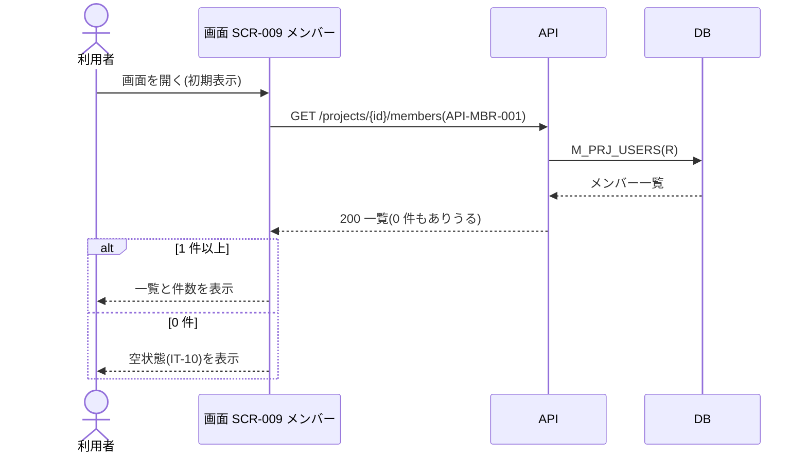
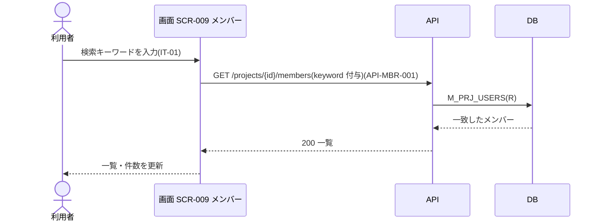
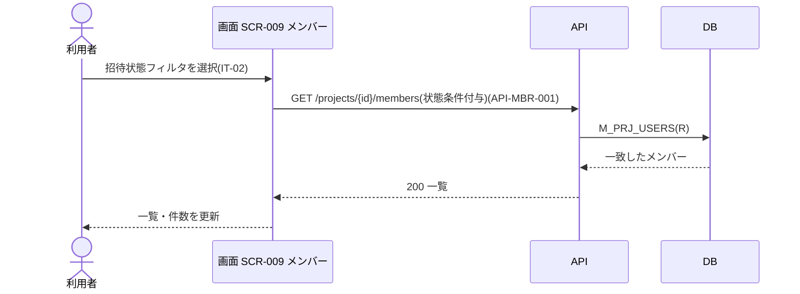
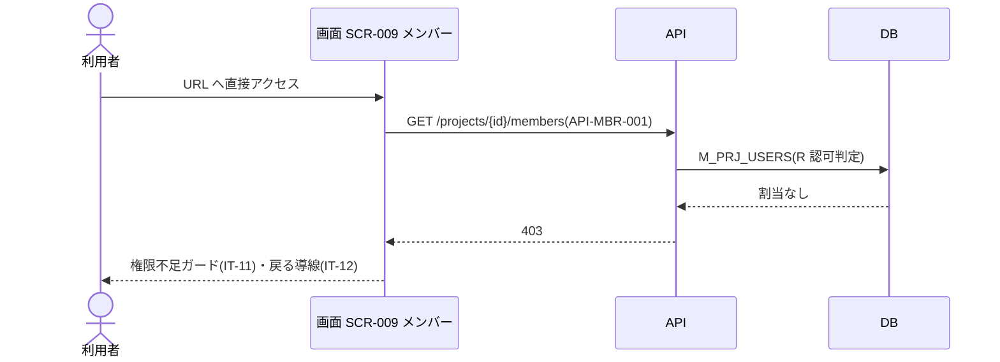

<!-- portal-top -->
[設計ポータル](../README.md) ／ [ユースケース](index.md) ／ **UC-SCR-009: メンバー(プロジェクト) ユースケース**
<!-- /portal-top -->

# UC-SCR-009: メンバー(プロジェクト) ユースケース

> **このページは、画面 SCR-009(メンバー(プロジェクト))の画面イベント EV-01〜EV-08 に対応する 8 つのユースケースを「1 イベント = 1 ユースケース」で定義します。**

*版数 v1.0 ・ 更新 2026-06-21 ・ ユースケース 8 ・ ステータス ドラフト*

## 0. イベント↔ユースケース対応表

画面 [SCR-009](../02_basic-design/SCR-009.md#SCR-009) の §6 画面イベント一覧(EV-01〜EV-08)を、ユースケース ID へ 1:1 で対応づけます。種別は、サーバ API・DB へアクセスする「API/DB 連携」と、画面内のみで完結する「クライアント内処理のみ」に区別します。

| イベント ID | イベント名 | ユースケース ID | 種別 |
|----|----|----|----|
| `EV-01` | 初期表示 | [UC-SCR-009-EV01](#UC-SCR-009-EV01) | API/DB 連携 |
| `EV-02` | 検索を入力 | [UC-SCR-009-EV02](#UC-SCR-009-EV02) | API/DB 連携 |
| `EV-03` | 招待状態フィルタを選択 | [UC-SCR-009-EV03](#UC-SCR-009-EV03) | API/DB 連携 |
| `EV-04` | 「+ メンバーを招待」を押下 | [UC-SCR-009-EV04](#UC-SCR-009-EV04) | クライアント内処理のみ |
| `EV-05` | (空状態)「+ メンバーを招待」を押下 | [UC-SCR-009-EV05](#UC-SCR-009-EV05) | クライアント内処理のみ |
| `EV-06` | 利用者表示名リンクを押下 | [UC-SCR-009-EV06](#UC-SCR-009-EV06) | クライアント内処理のみ |
| `EV-07` | 権限なしで URL 直アクセス | [UC-SCR-009-EV07](#UC-SCR-009-EV07) | API/DB 連携 |
| `EV-08` | 「ダッシュボードへ戻る」を押下 | [UC-SCR-009-EV08](#UC-SCR-009-EV08) | クライアント内処理のみ |

## 1. ユースケース定義

### UC-SCR-009-EV01 初期表示

> メンバー画面を開いたとき、当該プロジェクトのメンバー一覧を取得して表示し、0 件のときは空状態を表示します。

| 項目 | 内容 |
|----|----|
| 利用者 | オーナー / 当該プロジェクトのメンバー |
| 事前条件 | ログイン済みで、当該プロジェクトへの割当がある |
| トリガー | 画面 SCR-009 を開く(初期表示) |
| 事後条件 | メンバー一覧と件数表示(IT-03)を表示する。0 件のときは空状態(IT-10)を表示する |
| 関連 | [SCR-009](../02_basic-design/SCR-009.md#SCR-009) ・ [API-MBR-001](../02_basic-design/API-member.md#API-MBR-001) |

基本フロー

1. 利用者がメンバー画面を開く。
2. 画面は当該プロジェクトを条件にメンバー一覧取得 API を呼び出す。
3. API は認証・認可を検証し、当該プロジェクトのメンバー一覧を取得して返す。
4. 1 件以上のとき、画面は一覧と件数表示(IT-03)を描画する。
5. 0 件のとき、画面は空状態(IT-10)を表示する。

異常系フロー

- 認可エラー(403): 当該プロジェクトへの割当がない場合、権限不足ガード(IT-11)を表示する(EV-07 で扱う)。
- 取得失敗: 一覧を表示せず、エラートーストを表示する。

### UC-SCR-009-EV02 検索を入力

> 検索キーワードを入力すると、その条件を付与してメンバー一覧を再取得し、一覧を更新します。

| 項目 | 内容 |
|----|----|
| 利用者 | オーナー / 当該プロジェクトのメンバー |
| 事前条件 | メンバー画面を表示している |
| トリガー | 検索(IT-01)に表示名・メールアドレスのキーワードを入力する |
| 事後条件 | キーワードに部分一致するメンバーで一覧と件数表示(IT-03)を更新する。0 件時は空状態(IT-10)を表示する |
| 関連 | [SCR-009](../02_basic-design/SCR-009.md#SCR-009) ・ [API-MBR-001](../02_basic-design/API-member.md#API-MBR-001) |

基本フロー

1. 利用者が検索(IT-01)へキーワードを入力する。
2. 画面はキーワードを付与してメンバー一覧取得 API を再取得する。
3. API は条件に部分一致するメンバーを取得して返す。
4. 画面は一覧と件数表示(IT-03)を更新する。0 件のときは空状態(IT-10)を表示する。

異常系フロー

- 取得失敗: 一覧を更新せず、エラートーストを表示する。

### UC-SCR-009-EV03 招待状態フィルタを選択

> 招待状態フィルタを選択すると、その条件を付与してメンバー一覧を再取得し、一覧を更新します。

| 項目 | 内容 |
|----|----|
| 利用者 | オーナー / 当該プロジェクトのメンバー |
| 事前条件 | メンバー画面を表示している |
| トリガー | 招待状態フィルタ(IT-02)を選択する(すべて / 招待中のみ / アクティベーション済み) |
| 事後条件 | 選択した招待状態に一致するメンバーで一覧と件数表示(IT-03)を更新する。0 件時は空状態(IT-10)を表示する |
| 関連 | [SCR-009](../02_basic-design/SCR-009.md#SCR-009) ・ [API-MBR-001](../02_basic-design/API-member.md#API-MBR-001) |

基本フロー

1. 利用者が招待状態フィルタ(IT-02)を選択する。
2. 画面は招待状態条件を付与してメンバー一覧取得 API を再取得する。
3. API は条件に一致するメンバーを取得して返す。
4. 画面は一覧と件数表示(IT-03)を更新する。0 件のときは空状態(IT-10)を表示する。

異常系フロー

- 取得失敗: 一覧を更新せず、エラートーストを表示する。

### UC-SCR-009-EV04 「+ メンバーを招待」を押下

> 「+ メンバーを招待」を押下し、メンバー招待 / 編集モーダルを招待モードで開きます(クライアント内処理のみ)。

| 項目 | 内容 |
|----|----|
| 利用者 | オーナー / 当該プロジェクトのメンバー |
| 事前条件 | メンバー画面を表示している |
| トリガー | 「+ メンバーを招待」(IT-09)を押下する |
| 事後条件 | メンバー招待 / 編集モーダル([SCR-009-001](../02_basic-design/SCR-009-001.md#SCR-009-001))を招待モードで開く |
| 関連 | [SCR-009](../02_basic-design/SCR-009.md#SCR-009) ・ [SCR-009-001](../02_basic-design/SCR-009-001.md#SCR-009-001) |

基本フロー

1. 利用者が「+ メンバーを招待」(IT-09)を押下する。
2. 画面はメンバー招待 / 編集モーダル([SCR-009-001](../02_basic-design/SCR-009-001.md#SCR-009-001))を招待モードで開く。

異常系フロー

- なし(モーダル起動のみ。招待処理はモーダル SCR-009-001 で行う)。

クライアント内処理のみのため、シーケンス図は省略します。

### UC-SCR-009-EV05 (空状態)「+ メンバーを招待」を押下

> 空状態(IT-10)の「+ メンバーを招待」を押下し、メンバー招待 / 編集モーダルを招待モードで開きます(クライアント内処理のみ)。

| 項目 | 内容 |
|----|----|
| 利用者 | オーナー / 当該プロジェクトのメンバー |
| 事前条件 | メンバーが 0 件で、空状態(IT-10)を表示している |
| トリガー | 空状態の「+ メンバーを招待」(IT-10)を押下する |
| 事後条件 | メンバー招待 / 編集モーダル([SCR-009-001](../02_basic-design/SCR-009-001.md#SCR-009-001))を招待モードで開く |
| 関連 | [SCR-009](../02_basic-design/SCR-009.md#SCR-009) ・ [SCR-009-001](../02_basic-design/SCR-009-001.md#SCR-009-001) |

本ユースケースの処理は [UC-SCR-009-EV04](#UC-SCR-009-EV04)(「+ メンバーを招待」を押下)と同一です。トリガーが空状態(IT-10)内のボタンである点のみが異なります。基本フロー・異常系フローは UC-SCR-009-EV04 を参照してください。

### UC-SCR-009-EV06 利用者表示名リンクを押下

> 利用者表示名リンクを押下し、メンバー招待 / 編集モーダルを編集モードで開きます(クライアント内処理のみ)。

| 項目 | 内容 |
|----|----|
| 利用者 | オーナー / 当該プロジェクトのメンバー |
| 事前条件 | メンバー一覧に対象メンバーが表示されている |
| トリガー | 利用者表示名(IT-04)のリンクを押下する |
| 事後条件 | メンバー招待 / 編集モーダル([SCR-009-001](../02_basic-design/SCR-009-001.md#SCR-009-001))を編集モードで開く |
| 関連 | [SCR-009](../02_basic-design/SCR-009.md#SCR-009) ・ [SCR-009-001](../02_basic-design/SCR-009-001.md#SCR-009-001) |

基本フロー

1. 利用者が利用者表示名(IT-04)のリンクを押下する。
2. 画面は対象メンバーを引き継ぎ、メンバー招待 / 編集モーダル([SCR-009-001](../02_basic-design/SCR-009-001.md#SCR-009-001))を編集モードで開く。

異常系フロー

- オーナー行・ログイン中の自分の行はリンク化しないため、本イベントは発生しない(対象メンバーの取得は遷移先 SCR-009-001 で行う)。

クライアント内処理のみのため、シーケンス図は省略します。

### UC-SCR-009-EV07 権限なしで URL 直アクセス

> 当該プロジェクトに割当のないユーザーが URL に直接アクセスした場合、権限不足ガードを表示します(403 相当)。

| 項目 | 内容 |
|----|----|
| 利用者 | 当該プロジェクトに割当のないログイン済みユーザー |
| 事前条件 | ログイン済みだが、当該プロジェクトへの割当がない |
| トリガー | SCR-009 の URL に直接アクセスする |
| 事後条件 | 権限不足ガード(IT-11)を表示し、「ダッシュボードへ戻る」リンク(IT-12)を提示する(HTTP 403 相当) |
| 関連 | [SCR-009](../02_basic-design/SCR-009.md#SCR-009) ・ [API-MBR-001](../02_basic-design/API-member.md#API-MBR-001) |

基本フロー

1. 当該プロジェクトに割当のないユーザーが SCR-009 の URL に直接アクセスする。
2. 画面はメンバー一覧取得 API を呼び出す。
3. API は認可を検証し、割当がないため 403 を返す。
4. 画面は権限不足ガード(IT-11)と「ダッシュボードへ戻る」リンク(IT-12)を表示する。

異常系フロー

- なし(本イベント自体が認可エラー時の挙動)。

### UC-SCR-009-EV08 「ダッシュボードへ戻る」を押下

> 権限不足ガード内の「ダッシュボードへ戻る」を押下し、ダッシュボードへ遷移します(クライアント内処理のみ)。

| 項目 | 内容 |
|----|----|
| 利用者 | 当該プロジェクトに割当のないログイン済みユーザー |
| 事前条件 | 権限不足ガード(IT-11)を表示している(EV-07 実行済み) |
| トリガー | 「ダッシュボードへ戻る」(IT-12)を押下する |
| 事後条件 | ダッシュボードへ遷移する |
| 関連 | [SCR-009](../02_basic-design/SCR-009.md#SCR-009) |

基本フロー

1. 利用者が「ダッシュボードへ戻る」(IT-12)を押下する。
2. 画面はダッシュボードへ遷移する。

異常系フロー

- なし(画面遷移のみ)。

クライアント内処理のみのため、シーケンス図は省略します。

---

<!-- portal-bottom -->
[ユースケース](index.md) ・ [↑ 設計ポータル](../README.md)
<!-- /portal-bottom -->
