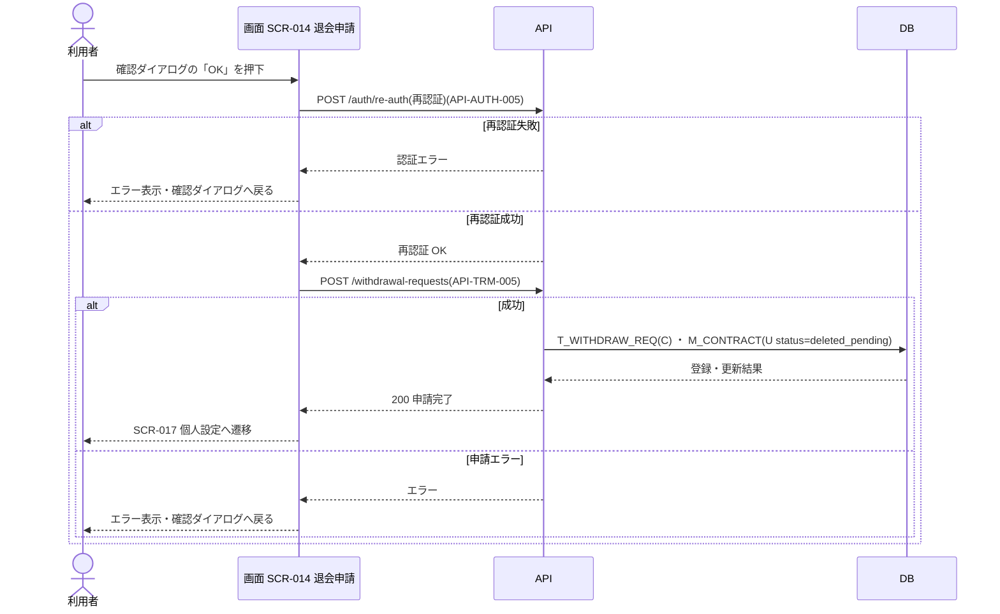

<!-- portal-top -->
[設計ポータル](../README.md) ／ [ユースケース](index.md) ／ **UC-SCR-014: 退会申請 ユースケース**
<!-- /portal-top -->

# UC-SCR-014: 退会申請 ユースケース

> **このページは、画面 SCR-014(退会申請)の画面イベント EV-01〜EV-08 に対応する 8 のユースケースを「1 イベント = 1 ユースケース」で定義します。**

*版数 v1.0 ・ 更新 2026-06-21 ・ ユースケース 8 ・ ステータス ドラフト*

## 0. イベント↔ユースケース対応表

画面 [SCR-014](../02_basic-design/SCR-014.md#SCR-014) の §6 画面イベント一覧(EV-01〜EV-08)を、ユースケース ID へ 1:1 で対応づけます。種別は、サーバ API・DB へアクセスする「API/DB 連携」と、画面内のみで完結する「クライアント内処理のみ」に区別します。

| イベント ID | イベント名 | ユースケース ID | 種別 |
|----|----|----|----|
| `EV-01` | 初期表示 | [UC-SCR-014-EV01](#UC-SCR-014-EV01) | クライアント内処理のみ |
| `EV-02` | 退会理由を入力 | [UC-SCR-014-EV02](#UC-SCR-014-EV02) | クライアント内処理のみ |
| `EV-03` | 「退会を申請する」を押下 | [UC-SCR-014-EV03](#UC-SCR-014-EV03) | クライアント内処理のみ |
| `EV-04` | 確認ダイアログの「OK」を押下 | [UC-SCR-014-EV04](#UC-SCR-014-EV04) | API/DB 連携 |
| `EV-05` | 「個人設定へ戻る」を押下 | [UC-SCR-014-EV05](#UC-SCR-014-EV05) | クライアント内処理のみ |
| `EV-06` | 契約名を入力 | [UC-SCR-014-EV06](#UC-SCR-014-EV06) | クライアント内処理のみ |
| `EV-07` | パスワードを入力(再認証) | [UC-SCR-014-EV07](#UC-SCR-014-EV07) | クライアント内処理のみ |
| `EV-08` | 「キャンセル」を押下 | [UC-SCR-014-EV08](#UC-SCR-014-EV08) | クライアント内処理のみ |

## 1. ユースケース定義

### UC-SCR-014-EV01 初期表示

> 退会申請画面を開いたとき、オーナー権限を確認し、退会時の影響を集約した警告パネルを表示します(クライアント内処理のみ)。

| 項目 | 内容 |
|----|----|
| 利用者 | オーナー(本画面はオーナー専有) |
| 事前条件 | ログイン済みで、オーナーである |
| トリガー | 画面 SCR-014 を開く(初期表示) |
| 事後条件 | 退会時の影響(サービス停止・データ削除・請求・メンバー失効)を集約した警告パネル(IT-01)を表示する。オーナー以外は権限不足画面を表示し本画面を表示しない |
| 関連 | [SCR-014](../02_basic-design/SCR-014.md#SCR-014) ・ [FR-009](../01_requirements/FR01.md#FR-009) |

基本フロー

1. 利用者が退会申請画面を開く。
2. 画面はログイン中のアカウント利用者がオーナーであることを確認する。
3. 画面は退会時の影響を集約した警告パネル(IT-01)を表示する。

異常系フロー

- 権限なし(オーナー以外): 権限不足画面を表示し、本画面を表示しない。

クライアント内処理のみのため、シーケンス図は省略します。

### UC-SCR-014-EV02 退会理由を入力

> 退会理由欄に入力すると、最大 500 文字を検証します(任意入力、クライアント内処理のみ)。

| 項目 | 内容 |
|----|----|
| 利用者 | オーナー(本画面はオーナー専有) |
| 事前条件 | SCR-014 が表示済み |
| トリガー | 退会理由(IT-02)へ入力する |
| 事後条件 | 500 文字以内なら入力を受け付ける。500 文字超過時はバリデーションエラーを表示し「退会を申請する」ボタンを無効化する |
| 関連 | [SCR-014](../02_basic-design/SCR-014.md#SCR-014) |

基本フロー

1. 利用者が退会理由(IT-02)へ任意で入力する。
2. 画面は文字数(最大 500 文字)を検証する。

異常系フロー

- 500 文字超過: バリデーションエラーを表示し、「退会を申請する」ボタンを無効化する。

クライアント内処理のみのため、シーケンス図は省略します。

### UC-SCR-014-EV03 「退会を申請する」を押下

> 「退会を申請する」を押下すると、影響の最終確認のための確認ダイアログを表示します(クライアント内処理のみ)。

| 項目 | 内容 |
|----|----|
| 利用者 | オーナー(本画面はオーナー専有) |
| 事前条件 | 契約名確認入力(IT-05)が契約名と一致し「退会を申請する」ボタンが有効 |
| トリガー | 「退会を申請する」(IT-04)を押下する |
| 事後条件 | 退会内容の確認ダイアログ(影響の最終確認)を表示する。実際の申請は EV-04 で実行する |
| 関連 | [SCR-014](../02_basic-design/SCR-014.md#SCR-014) |

基本フロー

1. 利用者が「退会を申請する」(IT-04)を押下する。
2. 画面は退会内容の確認ダイアログ(影響の最終確認)を表示する。

異常系フロー

- なし(契約名不一致時はボタンが無効のため本イベントは発生しない)。

クライアント内処理のみのため、シーケンス図は省略します。

### UC-SCR-014-EV04 確認ダイアログの「OK」を押下

> 確認ダイアログで OK を押下すると、再認証を行い、成功時に退会申請を登録して契約状態を退会保留へ更新し、個人設定へ遷移します。

| 項目 | 内容 |
|----|----|
| 利用者 | オーナー(本画面はオーナー専有) |
| 事前条件 | 退会内容の確認ダイアログが表示中(EV-03 実行済み)。再認証用パスワード(IT-06)が入力されている |
| トリガー | 確認ダイアログの「OK」を押下する |
| 事後条件 | 再認証成功時は退会申請を `T_WITHDRAW_REQ` に登録し、契約状態 `M_CONTRACT.status` を `deleted_pending` へ更新する。完了後は SCR-017 個人設定へ遷移する。失敗時は確認ダイアログへ戻る |
| 関連 | [SCR-014](../02_basic-design/SCR-014.md#SCR-014) ・ [API-AUTH-005](../02_basic-design/API-auth.md#API-AUTH-005) ・ [API-TRM-005](../02_basic-design/API-terms.md#API-TRM-005) ・ [FR-009](../01_requirements/FR01.md#FR-009) |

基本フロー

1. 利用者が確認ダイアログの「OK」を押下する。
2. 画面は再認証 API を呼び出し、本人確認を行う。
3. 再認証成功時、画面は退会申請 API を実行する。
4. API は退会申請を `T_WITHDRAW_REQ` に登録し、契約状態 `M_CONTRACT.status` を `deleted_pending` へ更新する。
5. 完了後、画面は SCR-017 個人設定へ遷移する。

異常系フロー

- 再認証失敗: エラーメッセージを表示し、確認ダイアログへ戻る。
- 退会申請 API エラー: エラーメッセージを表示し、確認ダイアログへ戻る。

> [!NOTE]
> 退会後の当月末サービス停止・当月末 + 30 日のデータ完全削除は時間駆動のシステム処理であり、本画面ユースケースのスコープ外です(実体は UC-SYSTEM の物理削除バッチ)。

### UC-SCR-014-EV05 「個人設定へ戻る」を押下

> 「個人設定へ戻る」を押下し、個人設定画面へ遷移します(クライアント内処理のみ)。

| 項目 | 内容 |
|----|----|
| 利用者 | オーナー(本画面はオーナー専有) |
| 事前条件 | SCR-014 が表示済み |
| トリガー | 「個人設定へ戻る」(IT-03)を押下する |
| 事後条件 | SCR-017 個人設定へ遷移する |
| 関連 | [SCR-014](../02_basic-design/SCR-014.md#SCR-014) ・ [SCR-017](../02_basic-design/SCR-017.md#SCR-017) |

基本フロー

1. 利用者が「個人設定へ戻る」(IT-03)を押下する。
2. 画面は SCR-017 個人設定へ遷移する。

異常系フロー

- なし(画面遷移のみ)。

クライアント内処理のみ(画面遷移)のため、シーケンス図は省略します。

### UC-SCR-014-EV06 契約名を入力

> 契約名確認欄に入力すると、入力値を契約名とリアルタイムで照合し、一致するときのみ「退会を申請する」ボタンを有効化します(クライアント内処理のみ)。

| 項目 | 内容 |
|----|----|
| 利用者 | オーナー(本画面はオーナー専有) |
| 事前条件 | SCR-014 が表示済み |
| トリガー | 契約名確認入力(IT-05)へ入力する |
| 事後条件 | 入力値が契約名と一致するとき「退会を申請する」(IT-04)を有効化し、不一致のとき無効化する |
| 関連 | [SCR-014](../02_basic-design/SCR-014.md#SCR-014) |

基本フロー

1. 利用者が契約名確認入力(IT-05)へ入力する。
2. 画面は入力値を契約名とリアルタイムで照合する。
3. 一致するとき、画面は「退会を申請する」ボタンの無効化を解除する。

異常系フロー

- 不一致: 「退会を申請する」ボタンを無効化する。

クライアント内処理のみのため、シーケンス図は省略します。

### UC-SCR-014-EV07 パスワードを入力(再認証)

> 再認証用パスワード欄に入力すると、入力値をマスク表示して保持します(クライアント内処理のみ)。

| 項目 | 内容 |
|----|----|
| 利用者 | オーナー(本画面はオーナー専有) |
| 事前条件 | SCR-014 が表示済み |
| トリガー | パスワード(再認証用)(IT-06)へ入力する |
| 事後条件 | 入力値をマスク表示して保持する(再認証は EV-04 で実行) |
| 関連 | [SCR-014](../02_basic-design/SCR-014.md#SCR-014) |

基本フロー

1. 利用者が再認証用パスワード(IT-06)を入力する。
2. 画面は入力値をマスク表示して保持する。

異常系フロー

- なし(再認証の検証は EV-04 で行う)。

クライアント内処理のみのため、シーケンス図は省略します。

### UC-SCR-014-EV08 「キャンセル」を押下

> 「キャンセル」を押下し、退会申請を中止して個人設定画面へ遷移します(クライアント内処理のみ)。

| 項目 | 内容 |
|----|----|
| 利用者 | オーナー(本画面はオーナー専有) |
| 事前条件 | SCR-014 が表示済み |
| トリガー | 「キャンセル」(IT-07)を押下する |
| 事後条件 | 退会申請を中止し、SCR-017 個人設定へ遷移する |
| 関連 | [SCR-014](../02_basic-design/SCR-014.md#SCR-014) ・ [SCR-017](../02_basic-design/SCR-017.md#SCR-017) |

基本フロー

1. 利用者が「キャンセル」(IT-07)を押下する。
2. 画面は退会申請を中止し、SCR-017 個人設定へ遷移する。

異常系フロー

- なし(画面遷移のみ)。

クライアント内処理のみ(画面遷移)のため、シーケンス図は省略します。

---

<!-- portal-bottom -->
[ユースケース](index.md) ・ [↑ 設計ポータル](../README.md)
<!-- /portal-bottom -->
