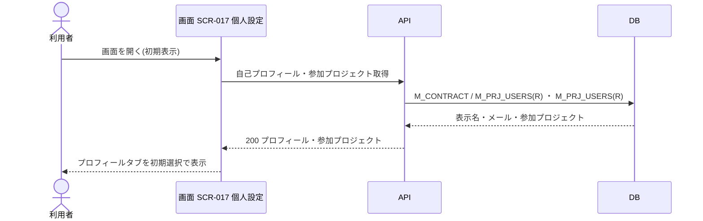
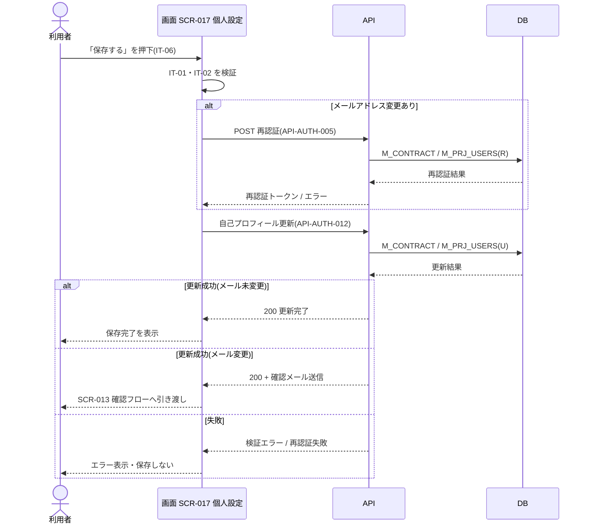
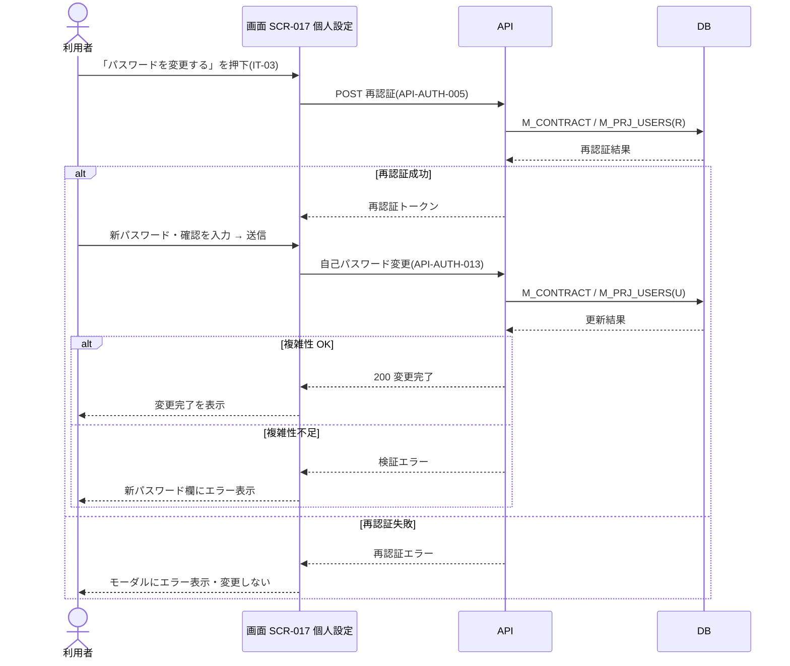

<!-- portal-top -->
[設計ポータル](../README.md) ／ [ユースケース](index.md) ／ **UC-SCR-017: 個人設定 ユースケース**
<!-- /portal-top -->

# UC-SCR-017: 個人設定 ユースケース

> **このページは、画面 SCR-017(個人設定)の画面イベント EV-01〜EV-08 に対応する 8 つのユースケースを「1 イベント = 1 ユースケース」で定義します。**

*版数 v1.0 ・ 更新 2026-06-21 ・ ユースケース 8 ・ ステータス ドラフト*

## 0. イベント↔ユースケース対応表

画面 [SCR-017](../02_basic-design/SCR-017.md#SCR-017) の §6 画面イベント一覧(EV-01〜EV-08)を、ユースケース ID へ 1:1 で対応づけます。種別は、サーバ API・DB へアクセスする「API/DB 連携」と、画面内のみで完結する「クライアント内処理のみ」に区別します。

| イベント ID | イベント名 | ユースケース ID | 種別 |
|----|----|----|----|
| `EV-01` | 初期表示 | [UC-SCR-017-EV01](#UC-SCR-017-EV01) | API/DB 連携 |
| `EV-02` | タブを押下 | [UC-SCR-017-EV02](#UC-SCR-017-EV02) | クライアント内処理のみ |
| `EV-03` | 表示名を入力 | [UC-SCR-017-EV03](#UC-SCR-017-EV03) | クライアント内処理のみ |
| `EV-04` | メールアドレスを入力 | [UC-SCR-017-EV04](#UC-SCR-017-EV04) | クライアント内処理のみ |
| `EV-05` | 「保存する」を押下(プロフィール) | [UC-SCR-017-EV05](#UC-SCR-017-EV05) | API/DB 連携 |
| `EV-06` | 「パスワードを変更する」を押下 | [UC-SCR-017-EV06](#UC-SCR-017-EV06) | API/DB 連携 |
| `EV-07` | 「変更を破棄」を押下 | [UC-SCR-017-EV07](#UC-SCR-017-EV07) | クライアント内処理のみ |
| `EV-08` | 参加プロジェクト名リンクを押下 | [UC-SCR-017-EV08](#UC-SCR-017-EV08) | クライアント内処理のみ |

## 1. ユースケース定義

### UC-SCR-017-EV01 初期表示

> 個人設定画面を開いたとき、自身のプロフィール情報と参加プロジェクト一覧を取得し、プロフィールタブを初期選択で表示します。

| 項目 | 内容 |
|----|----|
| 利用者 | 認証済みの利用者(オーナー / メンバー) |
| 事前条件 | ログイン済みである |
| トリガー | 画面 SCR-017 を開く(初期表示) |
| 事後条件 | 自身の表示名・メールアドレスおよび参加プロジェクト一覧を取得し、プロフィールタブを初期選択状態で表示する |
| 関連 | [SCR-017](../02_basic-design/SCR-017.md#SCR-017) ・ [FR-001](../01_requirements/FR01.md#FR-001) ・ [FR-151](../01_requirements/FR19.md#FR-151) |

基本フロー

1. 利用者が個人設定画面を開く。
2. 画面は認証済みユーザー自身のプロフィール情報(表示名・メールアドレス)を取得する。対象マスタはログイン中の actor 種別で特定する(オーナー / プロジェクトユーザーの両マスタは完全分離)。
3. 画面は参加プロジェクト一覧を取得する。
4. 画面はプロフィールタブを初期選択状態で表示する。

異常系フロー

- 取得失敗: 入力値を表示せず、エラーを表示する。

### UC-SCR-017-EV02 タブを押下

> タブ(プロフィール / セキュリティ / 参加プロジェクト)を押下し、対応するコンテンツ領域を切り替えます(クライアント内処理のみ)。

| 項目 | 内容 |
|----|----|
| 利用者 | 認証済みの利用者(オーナー / メンバー) |
| 事前条件 | 個人設定画面を表示している |
| トリガー | タブ(IT-05)を押下する |
| 事後条件 | 選択したタブのコンテンツ領域を表示し、他タブのコンテンツを非表示にする |
| 関連 | [SCR-017](../02_basic-design/SCR-017.md#SCR-017) |

クライアント内処理のみ(タブ切替によるデータ取得は行わない。データは EV-01 で取得済み)。

基本フロー

1. 利用者がタブ(IT-05)を押下する。
2. 画面は選択したタブ(プロフィール / セキュリティ / 参加プロジェクト)のコンテンツ領域を表示し、他タブのコンテンツを非表示にする。

異常系フロー

- なし(クライアント内処理のみ)。

### UC-SCR-017-EV03 表示名を入力

> 表示名入力欄の必須・文字数(1〜100 文字)をインラインで検証します(クライアント内処理のみ)。

| 項目 | 内容 |
|----|----|
| 利用者 | 認証済みの利用者(オーナー / メンバー) |
| 事前条件 | プロフィールタブを表示している |
| トリガー | 表示名(IT-01)を入力する |
| 事後条件 | 1〜100 文字の範囲内ならフィールドエラーを消去し、範囲外なら入力欄下部にエラーを表示する |
| 関連 | [SCR-017](../02_basic-design/SCR-017.md#SCR-017) ・ [FR-001](../01_requirements/FR01.md#FR-001) |

クライアント内処理のみ(バックエンド連携なし)。

基本フロー

1. 利用者が表示名(IT-01)を入力する。
2. 画面は必須・文字数(1〜100 文字)を画面内で検証する。
3. 範囲内ならフィールドエラーを消去する。

異常系フロー

- 空欄または 101 文字以上: 入力欄下部にバリデーションエラーを表示する。

### UC-SCR-017-EV04 メールアドレスを入力

> メールアドレス入力欄の必須・形式をインラインで検証します(クライアント内処理のみ)。

| 項目 | 内容 |
|----|----|
| 利用者 | 認証済みの利用者(オーナー / メンバー) |
| 事前条件 | プロフィールタブを表示している |
| トリガー | メールアドレス(IT-02)を入力する |
| 事後条件 | メールアドレス形式として正当ならフィールドエラーを消去し、不正なら入力欄下部にエラーを表示する |
| 関連 | [SCR-017](../02_basic-design/SCR-017.md#SCR-017) ・ [FR-005](../01_requirements/FR01.md#FR-005) |

クライアント内処理のみ(バックエンド連携なし)。

基本フロー

1. 利用者がメールアドレス(IT-02)を入力する。
2. 画面は必須・メールアドレス形式を画面内で検証する。
3. 正当ならフィールドエラーを消去する。

異常系フロー

- 空欄またはメールアドレス形式でない: 入力欄下部にバリデーションエラーを表示する。

### UC-SCR-017-EV05 「保存する」を押下(プロフィール)

> プロフィールタブの入力をサーバ検証して自己プロフィールを更新します。メールアドレス変更時は再認証を経て確認メールを送信し、確認フローへ引き渡します。

| 項目 | 内容 |
|----|----|
| 利用者 | 認証済みの利用者(オーナー / メンバー) |
| 事前条件 | プロフィールタブで表示名(IT-01)・メールアドレス(IT-02)を入力している |
| トリガー | 「保存する」(IT-06)を押下する |
| 事後条件 | メールアドレス未変更時は表示名・メールアドレスを更新して保存完了を表示する。メールアドレス変更時は再認証通過後に新メールアドレスへ確認メールを送信し、SCR-013 メールアドレス変更確認フローへ引き渡す |
| 関連 | [SCR-017](../02_basic-design/SCR-017.md#SCR-017) ・ [API-AUTH-012](../02_basic-design/API-auth.md#API-AUTH-012) ・ [API-AUTH-005](../02_basic-design/API-auth.md#API-AUTH-005) ・ [SCR-013](../02_basic-design/SCR-013.md#SCR-013) ・ [FR-005](../01_requirements/FR01.md#FR-005) |

基本フロー

1. 利用者が「保存する」(IT-06)を押下する。
2. 画面は IT-01・IT-02 の値をサーバー側で検証する。
3. 画面は自己プロフィール更新 API を呼び出し、自身のプロフィールを更新する。
4. メールアドレス未変更のとき、画面は保存完了メッセージを表示する。
5. メールアドレス変更のとき、画面は再認証 API で現パスワード再入力を求め、通過後に新メールアドレスへ確認メールを送信し、SCR-013 メールアドレス変更確認フローへ引き渡す(FR-005)。

異常系フロー

- バリデーションエラー: エラー内容を入力欄付近に表示し、保存しない。
- 再認証失敗(メールアドレス変更時): 再認証モーダルにエラーを表示し、保存しない。

### UC-SCR-017-EV06 「パスワードを変更する」を押下

> 再認証(現パスワード再入力)を経て、新パスワードへ更新します(12 文字以上・3 種以上)。

| 項目 | 内容 |
|----|----|
| 利用者 | 認証済みの利用者(オーナー / メンバー) |
| 事前条件 | セキュリティタブを表示している |
| トリガー | 「パスワードを変更する」(IT-03)を押下する |
| 事後条件 | 再認証通過後、新パスワード・確認パスワードの入力を受けて自身のパスワードを更新する |
| 関連 | [SCR-017](../02_basic-design/SCR-017.md#SCR-017) ・ [API-AUTH-005](../02_basic-design/API-auth.md#API-AUTH-005) ・ [API-AUTH-013](../02_basic-design/API-auth.md#API-AUTH-013) ・ [FR-005](../01_requirements/FR01.md#FR-005) ・ [FR-006](../01_requirements/FR01.md#FR-006) |

基本フロー

1. 利用者が「パスワードを変更する」(IT-03)を押下する。
2. 画面は再認証 API のモーダルを表示し、現パスワードの入力を求める(FR-005)。
3. 再認証成功後、画面は新パスワード・確認パスワードの入力フォームを表示する。
4. 利用者が送信すると、画面は自己パスワード変更 API を呼び出し、新パスワードへ更新する(FR-006 — 12 文字以上・3 種以上)。

異常系フロー

- 再認証失敗: モーダルにエラーを表示し、変更しない。
- パスワード複雑性不足: 新パスワード欄下部にエラーを表示し、変更しない。

### UC-SCR-017-EV07 「変更を破棄」を押下

> 「変更を破棄」を押下し、プロフィールタブの入力欄を初期値へ戻します(クライアント内処理のみ)。

| 項目 | 内容 |
|----|----|
| 利用者 | 認証済みの利用者(オーナー / メンバー) |
| 事前条件 | プロフィールタブで入力を編集している |
| トリガー | 「変更を破棄」(IT-09)を押下する |
| 事後条件 | 入力欄(IT-01・IT-02)の値を初期表示時の値へ戻す |
| 関連 | [SCR-017](../02_basic-design/SCR-017.md#SCR-017) |

クライアント内処理のみ(バックエンド連携なし)。

基本フロー

1. 利用者が「変更を破棄」(IT-09)を押下する。
2. 画面はプロフィールタブの入力欄(IT-01・IT-02)の値を初期表示時の値へ戻し、編集中の変更を破棄する。

異常系フロー

- なし(クライアント内処理のみ)。

### UC-SCR-017-EV08 参加プロジェクト名リンクを押下

> 参加プロジェクト名リンクを押下し、当該プロジェクトの概要画面へ遷移します(クライアント内処理のみ)。

| 項目 | 内容 |
|----|----|
| 利用者 | 認証済みの利用者(オーナー / メンバー) |
| 事前条件 | 参加プロジェクトタブで参加プロジェクト一覧(IT-04)を表示している |
| トリガー | 参加プロジェクト名リンク(IT-04)を押下する |
| 事後条件 | 該当プロジェクトの SCR-008 概要(プロジェクト)へ遷移する |
| 関連 | [SCR-017](../02_basic-design/SCR-017.md#SCR-017) ・ [SCR-008](../02_basic-design/SCR-008.md#SCR-008) |

クライアント内処理のみ(バックエンド連携なし)。

基本フロー

1. 利用者が参加プロジェクト名リンク(IT-04)を押下する。
2. 画面は該当プロジェクトの SCR-008 概要(プロジェクト)へ遷移する。

異常系フロー

- なし(画面遷移のみ)。

---

<!-- portal-bottom -->
[ユースケース](index.md) ・ [↑ 設計ポータル](../README.md)
<!-- /portal-bottom -->
