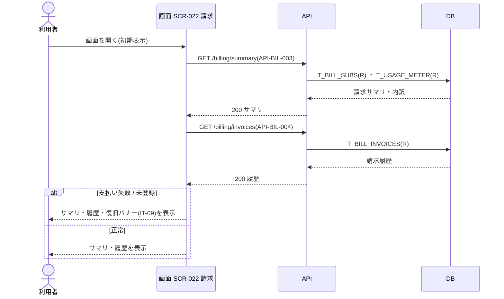
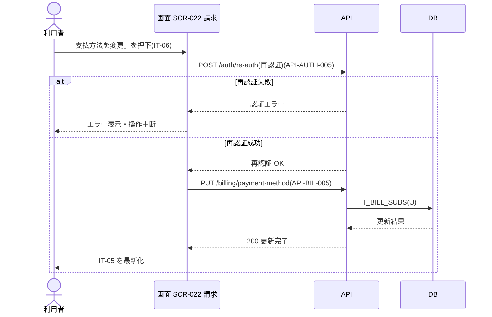
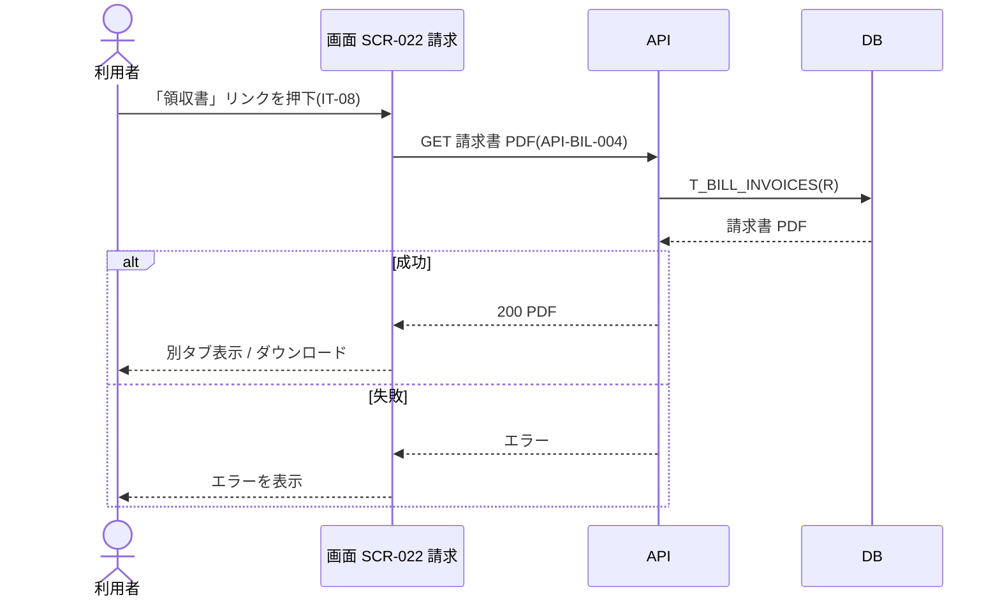
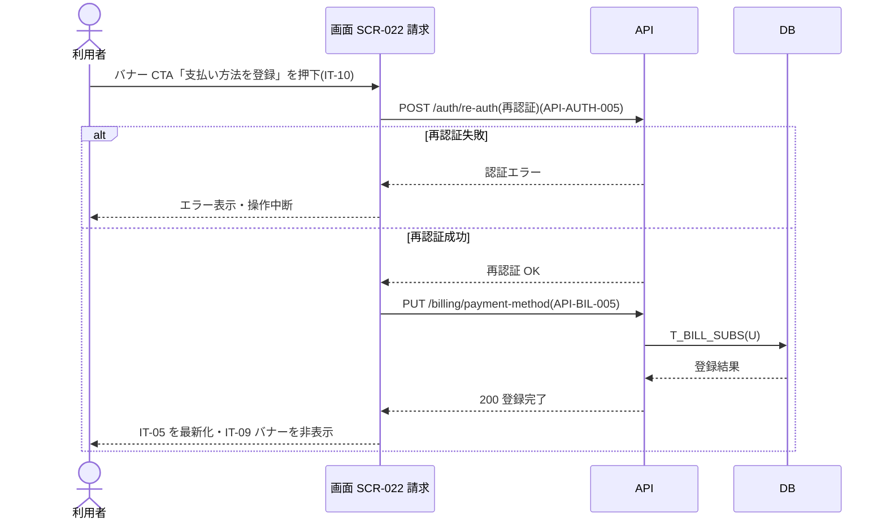

<!-- portal-top -->
[設計ポータル](../README.md) ／ [ユースケース](index.md) ／ **UC-SCR-022: 請求 ユースケース**
<!-- /portal-top -->

# UC-SCR-022: 請求 ユースケース

> **このページは、画面 SCR-022(請求)の画面イベント EV-01〜EV-07 に対応する 7 のユースケースを「1 イベント = 1 ユースケース」で定義します。**

*版数 v1.0 ・ 更新 2026-06-21 ・ ユースケース 7 ・ ステータス ドラフト*

## 0. イベント↔ユースケース対応表

画面 [SCR-022](../02_basic-design/SCR-022.md#SCR-022) の §6 画面イベント一覧(EV-01〜EV-07)を、ユースケース ID へ 1:1 で対応づけます。種別は、サーバ API・DB へアクセスする「API/DB 連携」と、画面内のみで完結する「クライアント内処理のみ」に区別します。

| イベント ID | イベント名 | ユースケース ID | 種別 |
|----|----|----|----|
| `EV-01` | 初期表示 | [UC-SCR-022-EV01](#UC-SCR-022-EV01) | API/DB 連携 |
| `EV-02` | 「支払方法を変更」を押下 | [UC-SCR-022-EV02](#UC-SCR-022-EV02) | API/DB 連携 |
| `EV-03` | 「領収書」リンクを押下 | [UC-SCR-022-EV03](#UC-SCR-022-EV03) | API/DB 連携 |
| `EV-04` | 「利用量と上限を確認」リンクを押下 | [UC-SCR-022-EV04](#UC-SCR-022-EV04) | クライアント内処理のみ |
| `EV-05` | 「退会手続きへ」リンクを押下 | [UC-SCR-022-EV05](#UC-SCR-022-EV05) | クライアント内処理のみ |
| `EV-06` | 「支払い方法を登録」を押下(バナー CTA) | [UC-SCR-022-EV06](#UC-SCR-022-EV06) | API/DB 連携 |
| `EV-07` | 「プランを変更」を押下 | [UC-SCR-022-EV07](#UC-SCR-022-EV07) | クライアント内処理のみ |

## 1. ユースケース定義

### UC-SCR-022-EV01 初期表示

> 請求画面を開いたとき、請求サマリ・プロジェクト別内訳・請求履歴を取得して表示し、支払い失敗・支払方法未登録時は復旧バナーを表示します。

| 項目 | 内容 |
|----|----|
| 利用者 | オーナー(本画面はオーナー専有) |
| 事前条件 | ログイン済みで、オーナーである |
| トリガー | 画面 SCR-022 を開く(初期表示) |
| 事後条件 | 請求見込み・次回請求日・請求状態・プロジェクト別内訳・支払方法(IT-01〜IT-05)と請求履歴(IT-07)を表示する。支払い失敗・支払方法未登録時は復旧バナー(IT-09)を表示する |
| 関連 | [SCR-022](../02_basic-design/SCR-022.md#SCR-022) ・ [API-BIL-003](../02_basic-design/API-billing.md#API-BIL-003) ・ [API-BIL-004](../02_basic-design/API-billing.md#API-BIL-004) ・ [FR-066](../01_requirements/FR09.md#FR-066) |

基本フロー

1. 利用者が請求画面を開く。
2. 画面は請求サマリ取得 API で請求見込み・次回請求日・請求状態・プロジェクト別内訳を取得し、IT-01〜IT-05 へ表示する。
3. 画面は請求履歴取得 API で請求月・金額・状態・PDF リンクを取得し、IT-07 へ表示する。
4. 請求状態が支払い失敗または支払方法未登録の場合、画面は復旧バナー(IT-09)を表示し、原因・影響・復旧手順・復旧 CTA を示す。

異常系フロー

- 権限なし(オーナー以外の URL 直アクセス): 権限不足を表示し、本画面を表示しない。
- 取得失敗: 当該データを表示せず、エラーメッセージを表示する。

### UC-SCR-022-EV02 「支払方法を変更」を押下

> 「支払方法を変更」を押下すると、課金情報変更のため再認証を求め、成功時に支払方法を登録・更新して表示を最新化します。

| 項目 | 内容 |
|----|----|
| 利用者 | オーナー(本画面はオーナー専有) |
| 事前条件 | 請求画面を表示している |
| トリガー | 「支払方法を変更」(IT-06)を押下する |
| 事後条件 | 再認証成功時は支払方法を登録・更新し、IT-05 を最新の情報へ更新する。失敗時は操作を中断する |
| 関連 | [SCR-022](../02_basic-design/SCR-022.md#SCR-022) ・ [API-AUTH-005](../02_basic-design/API-auth.md#API-AUTH-005) ・ [API-BIL-005](../02_basic-design/API-billing.md#API-BIL-005) ・ [FR-067](../01_requirements/FR09.md#FR-067) |

基本フロー

1. 利用者が「支払方法を変更」(IT-06)を押下する。
2. 画面は課金情報変更につき再認証(現パスワード再入力)を求め、再認証 API を呼び出す。
3. 再認証成功時、画面は支払方法取得・更新 API で支払方法を登録・更新する。
4. 画面は IT-05(支払方法)を最新の情報へ更新する。

異常系フロー

- 再認証失敗: エラーを表示し、操作を中断する。
- 更新失敗(その他): エラーを表示する。

### UC-SCR-022-EV03 「領収書」リンクを押下

> 請求履歴行の「領収書」リンクを押下すると、該当請求行の明細 PDF を取得して別タブ表示またはダウンロードします。

| 項目 | 内容 |
|----|----|
| 利用者 | オーナー(本画面はオーナー専有) |
| 事前条件 | 請求履歴(IT-07)が表示され、対象行に請求書 PDF リンク(IT-08)がある |
| トリガー | 「領収書」リンク(IT-08)を押下する |
| 事後条件 | 該当請求行の明細 PDF を別タブで表示またはダウンロードする |
| 関連 | [SCR-022](../02_basic-design/SCR-022.md#SCR-022) ・ [API-BIL-004](../02_basic-design/API-billing.md#API-BIL-004) |

基本フロー

1. 利用者が「領収書」リンク(IT-08)を押下する。
2. 画面は該当請求行の明細 PDF を取得する。
3. 画面は PDF を別タブで表示またはダウンロードとして保存する。

異常系フロー

- 取得失敗: ダウンロードを行わず、エラーを表示する。

### UC-SCR-022-EV04 「利用量と上限を確認」リンクを押下

> プロジェクト別内訳から「利用量と上限を確認」リンクを押下し、利用量と上限画面へ遷移します(クライアント内処理のみ)。

| 項目 | 内容 |
|----|----|
| 利用者 | オーナー(本画面はオーナー専有) |
| 事前条件 | 請求画面を表示している |
| トリガー | 「利用量と上限を確認」リンクを押下する |
| 事後条件 | SCR-021 利用量と上限へ遷移する |
| 関連 | [SCR-022](../02_basic-design/SCR-022.md#SCR-022) ・ [SCR-021](../02_basic-design/SCR-021.md#SCR-021) |

基本フロー

1. 利用者が「利用量と上限を確認」リンクを押下する。
2. 画面は SCR-021 利用量と上限へ遷移する。

異常系フロー

- なし(画面遷移のみ)。

クライアント内処理のみ(画面遷移)のため、シーケンス図は省略します。

### UC-SCR-022-EV05 「退会手続きへ」リンクを押下

> 「退会手続きへ」リンクを押下し、設定画面へ遷移して退会手続きを開始します(クライアント内処理のみ)。

| 項目 | 内容 |
|----|----|
| 利用者 | オーナー(本画面はオーナー専有) |
| 事前条件 | 請求画面を表示している |
| トリガー | 「退会手続きへ」リンクを押下する |
| 事後条件 | SCR-023 設定へ遷移し、退会手続きを開始する |
| 関連 | [SCR-022](../02_basic-design/SCR-022.md#SCR-022) ・ [SCR-023](../02_basic-design/SCR-023.md#SCR-023) |

基本フロー

1. 利用者が「退会手続きへ」リンクを押下する。
2. 画面は SCR-023 設定へ遷移する。

異常系フロー

- なし(画面遷移のみ)。

クライアント内処理のみ(画面遷移)のため、シーケンス図は省略します。

### UC-SCR-022-EV06 「支払い方法を登録」を押下(バナー CTA)

> 復旧バナーの「支払い方法を登録」を押下すると、再認証を経て支払方法を登録し、表示を最新化してバナーを非表示にします。

| 項目 | 内容 |
|----|----|
| 利用者 | オーナー(本画面はオーナー専有) |
| 事前条件 | 支払い失敗・支払方法未登録の復旧バナー(IT-09)を表示している |
| トリガー | バナー CTA「支払い方法を登録」(IT-10)を押下する |
| 事後条件 | 再認証成功時は支払方法を登録し、IT-05 を最新化し、IT-09 バナーを非表示にする。失敗時は操作を中断する |
| 関連 | [SCR-022](../02_basic-design/SCR-022.md#SCR-022) ・ [API-AUTH-005](../02_basic-design/API-auth.md#API-AUTH-005) ・ [API-BIL-005](../02_basic-design/API-billing.md#API-BIL-005) ・ [FR-067](../01_requirements/FR09.md#FR-067) |

基本フロー

1. 利用者がバナー CTA「支払い方法を登録」(IT-10)を押下する。
2. 画面は課金情報変更につき再認証(現パスワード再入力)を求め、再認証 API を呼び出す。
3. 再認証成功時、画面は支払方法取得・更新 API で支払方法を登録する。
4. 画面は IT-05 を最新化し、復旧バナー(IT-09)を非表示にする。

異常系フロー

- 再認証失敗: エラーを表示し、操作を中断する。
- 登録失敗(その他): エラーを表示する。

### UC-SCR-022-EV07 「プランを変更」を押下

> 「プランを変更」を押下し、プラン変更モーダルまたは画面を表示します(クライアント内処理のみ)。

| 項目 | 内容 |
|----|----|
| 利用者 | オーナー(本画面はオーナー専有) |
| 事前条件 | 請求画面を表示している |
| トリガー | 「プランを変更」(IT-11)を押下する |
| 事後条件 | プラン変更モーダルまたは画面を表示する |
| 関連 | [SCR-022](../02_basic-design/SCR-022.md#SCR-022) |

基本フロー

1. 利用者が「プランを変更」(IT-11)を押下する。
2. 画面はプラン変更モーダルまたは画面を表示する。

異常系フロー

- なし(モーダル / 画面起動のみ)。

> [!NOTE]
> プラン選択・確定の対応 API は現設計に未定義のため、遷移後の画面・モーダルでプラン選択・確定を行います。本イベント自体はモーダル / 画面の起動のみで、API/DB 連携を伴いません。

クライアント内処理のみ(モーダル / 画面起動)のため、シーケンス図は省略します。

---

<!-- portal-bottom -->
[ユースケース](index.md) ・ [↑ 設計ポータル](../README.md)
<!-- /portal-bottom -->
