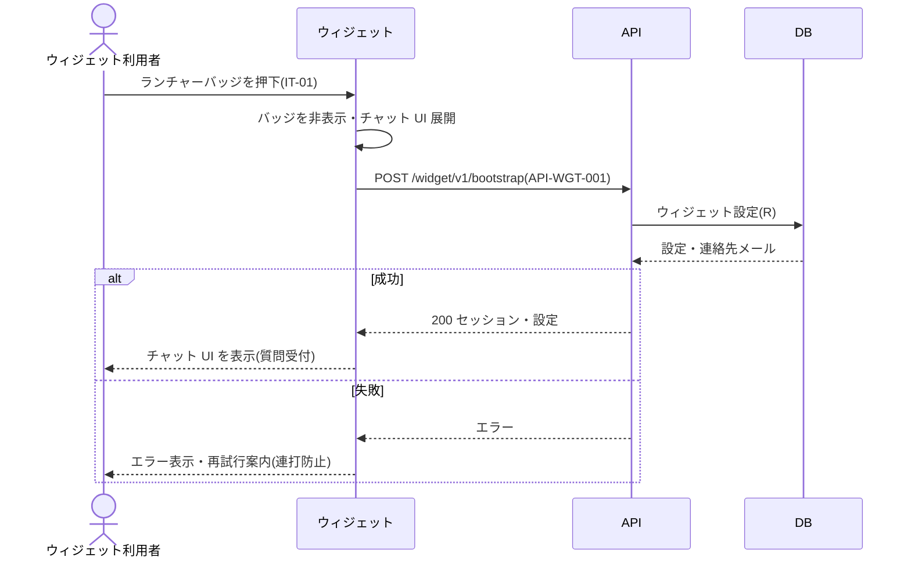
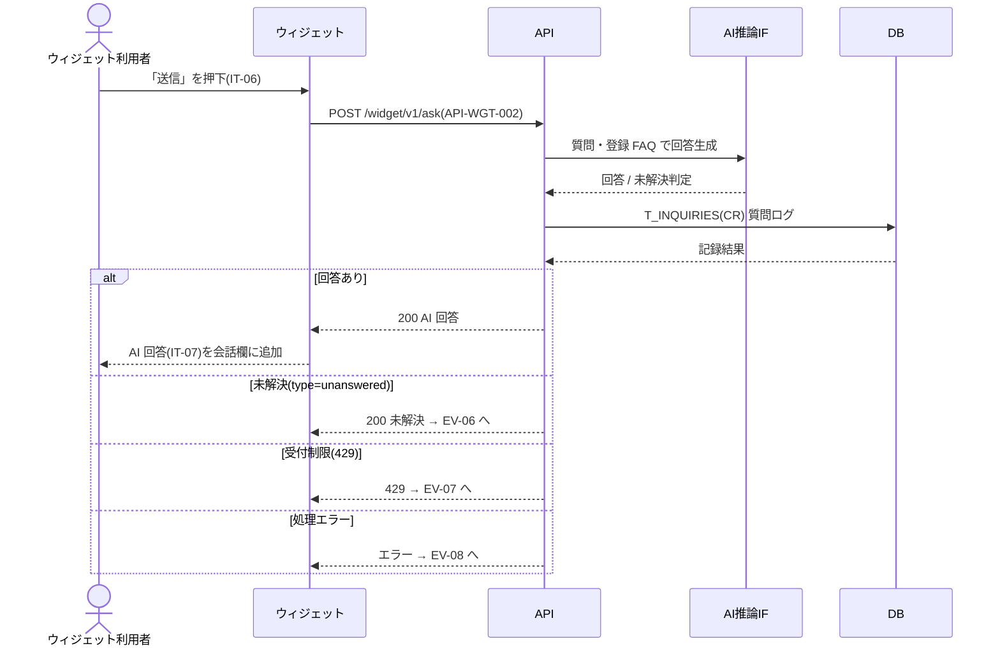
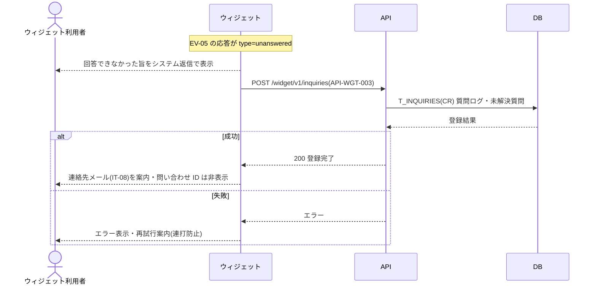

<!-- portal-top -->
[設計ポータル](../README.md) ／ [ユースケース](index.md) ／ **UC-SCR-WIDGET: エンドユーザー向け FAQ ウィジェット ユースケース**
<!-- /portal-top -->

# UC-SCR-WIDGET: エンドユーザー向け FAQ ウィジェット ユースケース

> **このページは、エンドユーザー向け FAQ ウィジェット(SCR-WIDGET)の画面イベント EV-01〜EV-08 に対応する 8 つのユースケースを「1 イベント = 1 ユースケース」で定義します。** 利用者はウィジェット利用者(エンドユーザー)です。

*版数 v1.0 ・ 更新 2026-06-21 ・ ユースケース 8 ・ ステータス ドラフト*

## 0. イベント↔ユースケース対応表

ウィジェット [SCR-WIDGET](../02_basic-design/SCR-WIDGET.md#WIDGET) の §6 画面イベント一覧(EV-01〜EV-08)を、ユースケース ID へ 1:1 で対応づけます。種別は、サーバ公開 API・DB へアクセスする「API/DB 連携」と、ウィジェット内のみで完結する「クライアント内処理のみ」に区別します。EV-06・EV-07・EV-08 は EV-05 の質問送信結果(応答種別)として続いて処理される状態遷移です。

| イベント ID | イベント名 | ユースケース ID | 種別 |
|----|----|----|----|
| `EV-01` | 初期表示 | [UC-SCR-WIDGET-EV01](#UC-SCR-WIDGET-EV01) | クライアント内処理のみ |
| `EV-02` | ランチャーバッジを押下 | [UC-SCR-WIDGET-EV02](#UC-SCR-WIDGET-EV02) | API/DB 連携 |
| `EV-03` | ヘッダーの閉じるボタンを押下 | [UC-SCR-WIDGET-EV03](#UC-SCR-WIDGET-EV03) | クライアント内処理のみ |
| `EV-04` | 質問を入力 | [UC-SCR-WIDGET-EV04](#UC-SCR-WIDGET-EV04) | クライアント内処理のみ |
| `EV-05` | 「送信」を押下 | [UC-SCR-WIDGET-EV05](#UC-SCR-WIDGET-EV05) | API/DB 連携 |
| `EV-06` | AI 回答(未解決)を受信 | [UC-SCR-WIDGET-EV06](#UC-SCR-WIDGET-EV06) | API/DB 連携 |
| `EV-07` | 受付制限(429)を受信 | [UC-SCR-WIDGET-EV07](#UC-SCR-WIDGET-EV07) | API/DB 連携 |
| `EV-08` | 処理エラーを受信 | [UC-SCR-WIDGET-EV08](#UC-SCR-WIDGET-EV08) | クライアント内処理のみ |

## 1. ユースケース定義

### UC-SCR-WIDGET-EV01 初期表示

> ウィジェットスクリプトが顧客サイトに組み込まれると、右下固定のランチャーバッジを表示します(クライアント内処理のみ)。

| 項目 | 内容 |
|----|----|
| 利用者 | ウィジェット利用者(エンドユーザー) |
| 事前条件 | 顧客サイトにウィジェットスクリプトが組み込まれている |
| トリガー | 顧客サイトの読み込み(初期表示) |
| 事後条件 | ランチャーバッジ(IT-01)を右下固定で表示する |
| 関連 | [SCR-WIDGET](../02_basic-design/SCR-WIDGET.md#WIDGET) ・ [FR-034](../01_requirements/FR05.md#FR-034) |

クライアント内処理のみ(この段階ではサーバ連携を行わない。セッション確立は EV-02 で行う)。

基本フロー

1. ウィジェットスクリプトが顧客サイトに組み込まれる。
2. ウィジェットはランチャーバッジ(IT-01)を右下固定で表示する。

異常系フロー

- なし(バッジ表示のみ)。

### UC-SCR-WIDGET-EV02 ランチャーバッジを押下

> ランチャーバッジを押下するとチャット UI を展開し、ウィジェット起動 API でセッションを確立して設定を取得します。

| 項目 | 内容 |
|----|----|
| 利用者 | ウィジェット利用者(エンドユーザー) |
| 事前条件 | ランチャーバッジ(IT-01)が表示されている |
| トリガー | ランチャーバッジ(IT-01)を押下する(Enter / Space キーによる起動も同等) |
| 事後条件 | バッジを非表示にしてチャット UI を展開し、セッションを確立してウィジェット設定(タイトル・連絡先メール等)を取得する |
| 関連 | [SCR-WIDGET](../02_basic-design/SCR-WIDGET.md#WIDGET) ・ [API-WGT-001](../02_basic-design/API-widget.md#API-WGT-001) ・ [FR-034](../01_requirements/FR05.md#FR-034) |

基本フロー

1. ウィジェット利用者がランチャーバッジ(IT-01)を押下する(Enter / Space キーも同等)。
2. ウィジェットはバッジを非表示にし、チャット UI を展開する。
3. ウィジェットはウィジェット起動 API でセッションを確立し、ウィジェット設定(タイトル・連絡先メール等)を取得する。

異常系フロー

- 起動失敗: エラーメッセージを会話欄に表示し、再試行案内を行う(連打防止付き)。

### UC-SCR-WIDGET-EV03 ヘッダーの閉じるボタンを押下

> 閉じるボタンを押下し、チャット UI を閉じてランチャーバッジ表示へ戻します(クライアント内処理のみ)。

| 項目 | 内容 |
|----|----|
| 利用者 | ウィジェット利用者(エンドユーザー) |
| 事前条件 | チャット UI を展開している |
| トリガー | ヘッダーの閉じるボタン(IT-03)を押下する |
| 事後条件 | チャット UI を閉じてランチャーバッジ表示へ戻る。同一ページ内では会話履歴・入力内容・受付状態を保持する |
| 関連 | [SCR-WIDGET](../02_basic-design/SCR-WIDGET.md#WIDGET) |

クライアント内処理のみ(バックエンド連携なし)。

基本フロー

1. ウィジェット利用者が閉じるボタン(IT-03)を押下する。
2. ウィジェットはチャット UI を閉じてランチャーバッジ表示へ戻る。
3. ウィジェットは同一ページ内で会話履歴・入力内容・受付状態を保持する。

異常系フロー

- なし(クライアント内処理のみ)。

### UC-SCR-WIDGET-EV04 質問を入力

> 質問入力欄に質問文を入力します(クライアント内処理のみ)。

| 項目 | 内容 |
|----|----|
| 利用者 | ウィジェット利用者(エンドユーザー) |
| 事前条件 | チャット UI を展開しており、受付制限中ではない |
| トリガー | 質問入力(IT-05)に質問文を入力する |
| 事後条件 | 入力内容を質問入力欄に保持する。受付制限中は入力欄が無効化され操作できない |
| 関連 | [SCR-WIDGET](../02_basic-design/SCR-WIDGET.md#WIDGET) ・ [FR-034](../01_requirements/FR05.md#FR-034) |

クライアント内処理のみ(バックエンド連携なし)。

基本フロー

1. ウィジェット利用者が質問入力(IT-05)に質問文を入力する。
2. ウィジェットは入力内容を保持する。

異常系フロー

- 受付制限中(EV-07 後): 入力欄が無効化されているため操作できない。

### UC-SCR-WIDGET-EV05 「送信」を押下

> 「送信」を押下すると質問を送信して AI 回答を同じ会話欄に追加表示します。応答種別により未解決(EV-06)・受付制限(EV-07)・処理エラー(EV-08)へ続きます。

| 項目 | 内容 |
|----|----|
| 利用者 | ウィジェット利用者(エンドユーザー) |
| 事前条件 | 質問を入力しており、受付制限中ではない(送信ボタンが活性) |
| トリガー | 「送信」(IT-06)を押下する |
| 事後条件 | 質問を送信し、AI 回答(IT-07)を同じ会話欄に追加表示する。応答種別に応じて未解決(EV-06)・受付制限(EV-07)・処理エラー(EV-08)へ続く |
| 関連 | [SCR-WIDGET](../02_basic-design/SCR-WIDGET.md#WIDGET) ・ [API-WGT-002](../02_basic-design/API-widget.md#API-WGT-002) ・ [FR-038](../01_requirements/FR05.md#FR-038) |

基本フロー

1. ウィジェット利用者が「送信」(IT-06)を押下する。
2. ウィジェットはウィジェット質問送信 API で質問を送信する。API は登録 FAQ をもとに AI 推論で回答を生成する。
3. 回答できた場合、ウィジェットは AI 回答(IT-07)を同じ会話欄に追加表示する。

異常系フロー

- 応答が未解決(`type=unanswered`): 続けて [UC-SCR-WIDGET-EV06](#UC-SCR-WIDGET-EV06) の処理が発生する。
- 受付制限(429)を受信: 続けて [UC-SCR-WIDGET-EV07](#UC-SCR-WIDGET-EV07) の処理が発生する。
- 処理エラー: 続けて [UC-SCR-WIDGET-EV08](#UC-SCR-WIDGET-EV08) の処理が発生する。

### UC-SCR-WIDGET-EV06 AI 回答(未解決)を受信

> 質問送信の応答が未解決のとき、未解決の旨を表示し、未解決質問を登録して連絡先メールを案内します。

| 項目 | 内容 |
|----|----|
| 利用者 | ウィジェット利用者(エンドユーザー) |
| 事前条件 | 質問送信(EV-05)の応答が未解決(`type=unanswered`)である |
| トリガー | ウィジェット質問送信 API のレスポンスが `type=unanswered`(EV-05 の結果として続いて処理) |
| 事後条件 | 回答できなかった旨をシステム返信として表示し、質問ログと未解決質問を登録する。連絡先メール設定済みのときは連絡先メール(IT-08)を案内表示する。別の質問の入力・送信は引き続き可能 |
| 関連 | [SCR-WIDGET](../02_basic-design/SCR-WIDGET.md#WIDGET) ・ [API-WGT-003](../02_basic-design/API-widget.md#API-WGT-003) ・ [FR-045](../01_requirements/FR06.md#FR-045) |

基本フロー

1. ウィジェット質問送信 API のレスポンスが `type=unanswered` となる(EV-05 の結果)。
2. ウィジェットは回答できなかった旨をシステム返信として会話欄に追加表示する。
3. ウィジェットはウィジェット未解決質問登録 API を呼び出し、質問ログと未解決質問を登録する。
4. 確認済みプロジェクト連絡先メールが設定済みのとき、ウィジェットは連絡先メール(IT-08)を案内表示する。
5. ウィジェットは管理用の問い合わせ ID を表示しない。別の質問の入力・送信は引き続き可能とする(EV-04 / EV-05 へ戻れる)。

異常系フロー

- 未解決登録失敗: エラーメッセージを表示し、再試行案内を行う(連打防止付き)。

### UC-SCR-WIDGET-EV07 受付制限(429)を受信

> 質問送信の応答が受付制限(429)のとき、受付停止メッセージを表示し、入力欄・送信ボタンを無効化します。

| 項目 | 内容 |
|----|----|
| 利用者 | ウィジェット利用者(エンドユーザー) |
| 事前条件 | 質問送信(EV-05)で質問数上限到達または支払方法ゲートによる 429 を受信した |
| トリガー | ウィジェット質問送信 API から 429 を受信(EV-05 の結果として続いて処理) |
| 事後条件 | 受付停止メッセージ(IT-09)をシステム返信として表示し、連絡先メール設定済みのときは連絡先メール(IT-08)を案内表示する。質問入力欄(IT-05)・送信ボタン(IT-06)を無効化する |
| 関連 | [SCR-WIDGET](../02_basic-design/SCR-WIDGET.md#WIDGET) ・ [API-WGT-002](../02_basic-design/API-widget.md#API-WGT-002) ・ [FR-073](../01_requirements/FR09.md#FR-073) |

基本フロー

1. ウィジェット質問送信 API から質問数上限到達または支払方法ゲートによる 429 を受信する(EV-05 の結果)。
2. ウィジェットは受付停止メッセージ(IT-09)をシステム返信として会話欄に追加表示する。
3. 確認済みプロジェクト連絡先メールが設定済みのとき、ウィジェットは連絡先メール(IT-08)を案内表示する(未設定時は再試行案内に差し替える)。
4. ウィジェットは質問入力欄(IT-05)および送信ボタン(IT-06)を無効化する。

異常系フロー

- なし(受信した受付制限状態を表示・反映する処理のため、追加の異常系はない)。

> [!NOTE]
> 質問数上限到達・支払方法ゲートの判定はサーバ側で行い、ウィジェットは受信した 429 を表示・反映する。上限到達によるウィジェット受付停止の実体はシステム側で定義する(UC-SYSTEM)。

### UC-SCR-WIDGET-EV08 処理エラーを受信

> ウィジェット起動または質問送信で処理エラーを受信したとき、エラー内容と再試行案内を表示します(未解決登録とは区別)。

| 項目 | 内容 |
|----|----|
| 利用者 | ウィジェット利用者(エンドユーザー) |
| 事前条件 | ウィジェット起動または質問送信で処理エラー(通信障害・上流障害・認可エラー等)が発生した |
| トリガー | ウィジェット起動 API または質問送信 API の処理エラー |
| 事後条件 | エラーメッセージ(IT-10)を会話欄または UI 内に表示する。再試行が妥当な場合は再試行案内を表示する。処理エラーは未解決質問として自動登録しない |
| 関連 | [SCR-WIDGET](../02_basic-design/SCR-WIDGET.md#WIDGET) ・ [API-WGT-001](../02_basic-design/API-widget.md#API-WGT-001) ・ [API-WGT-002](../02_basic-design/API-widget.md#API-WGT-002) |

クライアント内処理のみ(受信したエラーを表示する処理であり、ウィジェットからの追加の永続更新は行わない)。

基本フロー

1. ウィジェット起動または質問送信の処理エラー(通信障害・上流障害・認可エラー等)が発生する。
2. ウィジェットはエラーメッセージ(IT-10)を会話欄または UI 内に表示する。
3. 再試行が妥当なとき、ウィジェットは再試行案内を表示する(連打防止付き)。
4. ウィジェットは処理エラーを未解決質問として自動登録しない(未解決登録分岐とは区別する)。

異常系フロー

- なし(本ユースケース自体が処理エラー受信時の表示処理である)。

---

<!-- portal-bottom -->
[ユースケース](index.md) ・ [↑ 設計ポータル](../README.md)
<!-- /portal-bottom -->
