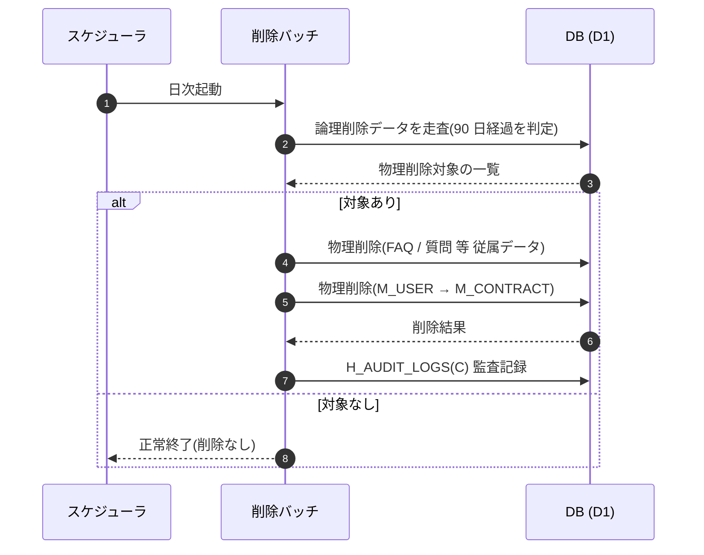

<!-- portal-top -->
[設計ポータル](../README.md) ／ [ユースケース](index.md) ／ **UC-SYSTEM-003: 90 日物理削除バッチ**
<!-- /portal-top -->

# UC-SYSTEM-003: 90 日物理削除バッチ

> **このページは、退会等で論理削除されたデータのうち削除から 90 日を経過したものを、依存関係の順序に従って物理削除し、監査記録を残す日次バッチのシステムユースケースを定義します。**

*版数 v1.0 ・ 更新 2026-06-21 ・ 種別 定期バッチ ・ ステータス ドラフト*

## 1. 概要

退会申請([SCR-014](../02_basic-design/SCR-014.md#SCR-014) / 設定 [SCR-023](../02_basic-design/SCR-023.md#SCR-023))や各種削除操作により論理削除されたデータを対象に、日次バッチが論理削除日からの経過日数を判定する。90 日(猶予期間)を経過したデータを、依存関係の順序(契約 → 利用者 → FAQ / 質問 等)で物理削除する。削除は監査ログ `H_AUDIT_LOGS(C)` に記録する。

| 項目 | 内容 |
|---|---|
| 目的 | 退会・削除後の猶予期間(90 日)経過データを確定削除し、データ最小化を担保する |
| 関連要件 | [FR-100](../01_requirements/FR13.md#FR-100) 退会時の猶予期間後のデータ削除 |
| 主テーブル | `M_CONTRACT` ・ `M_USER` ・ `M_FAQS` ・ `T_INQUIRIES` ・ `T_WITHDRAW_REQ`(物理削除)・ `H_AUDIT_LOGS(C)` |
| 関連画面 | [SCR-014](../02_basic-design/SCR-014.md#SCR-014) 退会申請 ・ [SCR-023](../02_basic-design/SCR-023.md#SCR-023) 設定 |

## 2. 利用者(アクター)

| アクター | 役割 |
|---|---|
| 削除バッチ(システム) | 経過判定・依存順物理削除・監査記録を行う日次バッチ |
| スケジューラ(システム) | 日次でバッチを起動する |

## 3. 事前条件

- 対象データが論理削除済みで、論理削除日が記録されている。
- 退会等の猶予期間(90 日)が定義されている。

## 4. トリガー

定期バッチ(日次)。スケジューラが 1 日 1 回バッチを起動する。

## 5. 基本フロー

1. スケジューラが削除バッチを起動する。
2. バッチが論理削除済みデータを走査し、論理削除日から 90 日を経過したものを物理削除対象として抽出する。
3. 抽出した対象を、依存関係の順序で物理削除する。
   1. 契約(`M_CONTRACT`)配下の従属データから順に処理する。
   2. 依存の深い側(FAQ `M_FAQS` / 質問 `T_INQUIRIES` / 退会申請 `T_WITHDRAW_REQ` 等)を先に削除する。
   3. 利用者(`M_USER`)、契約(`M_CONTRACT`)の順で削除する。
4. 削除した対象を監査ログ `H_AUDIT_LOGS(C)` に記録する。

> [!NOTE]
> 削除は依存関係の上流が下流より先に消えないよう、従属データ(FAQ / 質問 等)から契約・利用者へ向かう順序で行う。具体の参照制約の扱いは詳細設計で定める。

## 6. 異常系フロー

- **対象なし**: 90 日経過データが無い場合は削除を行わず、正常終了する。
- **削除中のエラー**: いずれかの対象で削除が失敗した場合は当該対象の削除を中止し、整合性を損なわない範囲で処理を継続する。失敗は監査ログに記録し、次回バッチで再評価する。

## 7. 事後条件

- 90 日を経過した論理削除データが物理削除され、**復元できない**(不可逆)。
- 削除は依存関係の順序で行われ、参照整合性を損なわない。
- 削除内容が監査ログに記録される。**監査ログ等の法令・運用上の保持義務があるデータは削除対象外**とし、保持期間に従って別途管理する([FR-100](../01_requirements/FR13.md#FR-100))。

## 8. シーケンス図

---

<!-- portal-bottom -->
[ユースケース](index.md) ・ [↑ 設計ポータル](../README.md)
<!-- /portal-bottom -->
